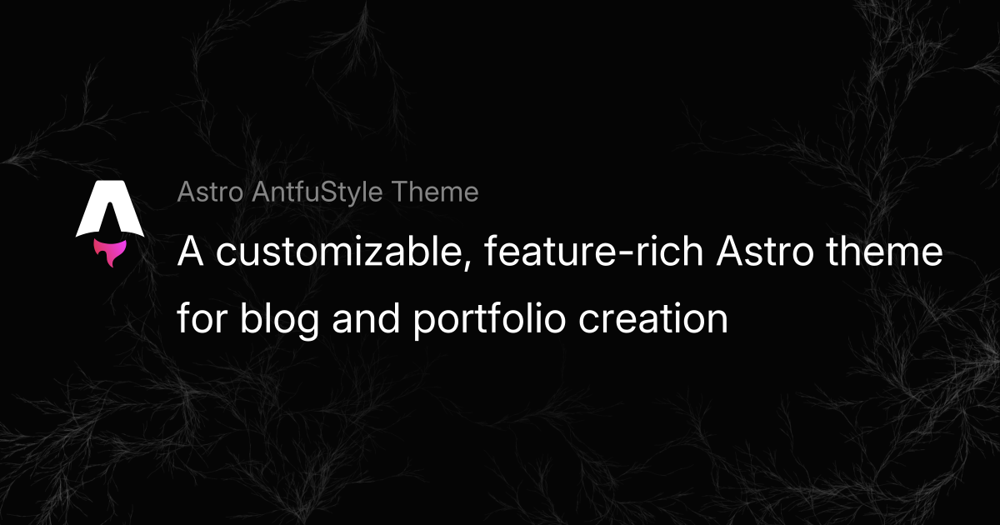
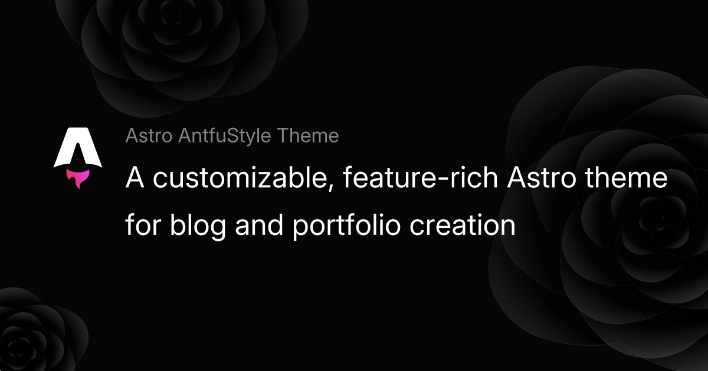
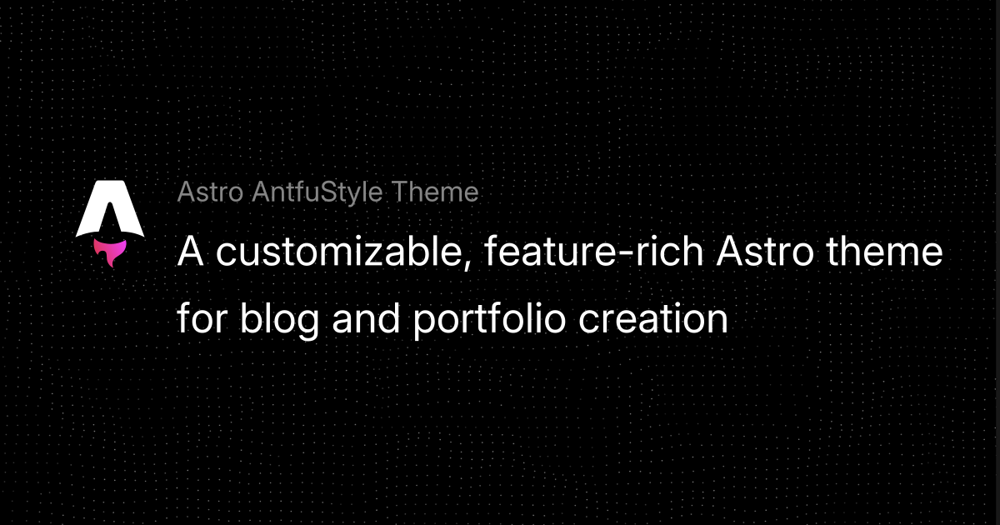
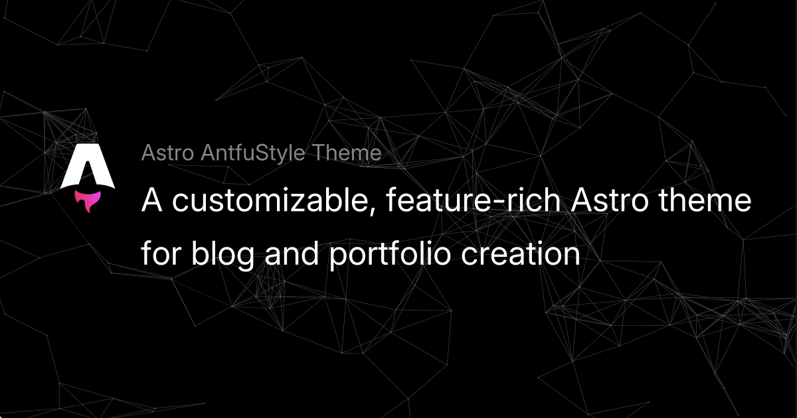

This post explains how to configure Open Graph (OG) images in the [Astro AntfuStyle Theme](https://github.com/lin-stephanie/astro-antfustyle-theme).

## What Are Open Graph Images?

OG images, short for Open Graph images, are metadata images used by social media platforms to visually represent a webpage when shared. Originating from Facebook's [Open Graph protocol](https://ogp.me/),  they make shared content more engaging.

Platforms like Facebook, Twitter, LinkedIn, and Discord use these images. While Twitter uses its own protocol ([Twitter Cards](https://developer.x.com/en/docs/x-for-websites/cards/overview/abouts-cards)), "OG image" is often used as a general term for these images.

## Configuring OG Images

There are three ways to configure OG images in this theme, listed by priority:

**Method 1**: Specify the `ogImage` field in the Markdown/MDX frontmatter with a custom image, which should be saved in `/public/og-images/`. For example:

```md title='src/content/blog/about-open-graph-images.md' {5}
---
title: About Open Graph Images

# The specified OG image must be saved: `public/og-images/specified-og-image.png`
ogImage: specified-og-image.png
---
```

> [!important]
>
> If the image isn’t found in `/public/og-images/`, a fallback `og-image.png` will be used.

**Method 2**: Set `ogImage` to `true` or remove the field to automatically generate an OG image, saved in `/public/og-images/`. The generated filename will match the Markdown/MDX file, or the directory if it's named `index.md` or `index.mdx`. For example:

```mdx title='src/pages/blog/index.mdx' {5}
---
title: Blog

# Auto-generated OG image is saved: `public/og-images/blog.png`
ogImage: true
---
```

> [!warning]
>
> OG images won’t generate if the frontmatter has `redirect`, `draft: true`, or is missing the `title` field.

**Method 3**: Set `ogImage` to `false` to prevent generation and use the fallback OG image instead. A fallback OG image named `og-image.png` is stored in `/public/og-images/`, ensuring that any page shared on social platforms displays an image.  

> [!important]
>
> If you need to regenerate the fallback OG image or after modifying `FEATURE.ogImage`, delete `og-image.png` to create a new fallback image.

## Template for Auto-Generated OG Images

The template (located in `plugins/og-template/markup.ts`) for auto-generated OG images is built with HTML + UnoCSS and processed by :link[satori-html]{id=natemoo-re/satori-html .github}. It takes three parameters:

- `authorOrBrand`: Defined by `FEATURE.image[1].authorOrBrand` (also for fallback image) and displayed above the `title`.
- `title`: Determined by the `title` field in the Markdown/MDX frontmatter; for fallback images, `FEATURE.image[1].fallbackTitle` is used.
- `bgType`: Set in the MDX frontmatter within `src/pages/`, using `FEATURE.image[1].fallbackBgType`(also for fallback image) if not set or set to `false`.

For details on how to replace the logo in the template, refer to [Advanced Configuration - Customizing Logo](../advanced-configuration/#customizing-logo).

"Below are the OG images generated with `bgType` set to 'plum', 'rose', 'dot', and 'particle':









## How This Theme Automatically Generates OG Images

This theme uses a custom remark plugin (located in [`plugins/remark-generate-og-image.ts`](https://github.com/lin-stephanie/astro-antfustyle-theme/blob/main/plugins/remark-generate-og-image.ts)) to handle the automatic generation of OG images. The decision to use a remark plugin instead of creating [Astro endpoints](https://liruifengv.com/posts/astro-auto-gen-og-image/) was made for the following reasons:

- Each Markdown/MDX file is processed by the remark plugin, allowing the logic for automatically generating OG images to be fully contained within the plugin. If you used endpoints, multiple static file endpoints might be required to generate OG images for each page, which adds complexity. _This is why the theme uses `.mdx` in `src/pages/` to generate pages_.
- The remark plugin can easily access the necessary parameters for the template. In an Astro project, a configured remark plugin receives the frontmatter for each Markdown/MDX file ([`file.data.astro.frontmatter`](https://docs.astro.build/en/guides/markdown-content/#modifying-frontmatter-programmatically)). With endpoints, under [dynamic routing](https://docs.astro.build/en/guides/routing/#static-ssg-mode), you’d need to use the [`getStaticPaths` API](https://docs.astro.build/en/reference/api-reference/#getstaticpaths) and include dynamic path parameters and template data in the return values.
- OG images can be centrally managed and previewed in the development environment. Since Astro's [remark and rehype pipelines run when content is rendered](https://docs.astro.build/en/guides/content-collections/#modifying-frontmatter-with-remark), meaning you can trigger OG image generation in the development environment. Using endpoints, however, would only allow you to see the output in the build directory after project completion, with no option to store them in a centralized location.

## Extra Tips

Auto-generated OG images are compressed with :link[sharp]{id=lovell/sharp .github}. For custom images, consider [manual compression](../managing-image-assets/#image-compression). 

If an image with the same name as the Markdown/MDX file (or the directory for `index.md/index.mdx`) already exists in `/public/og-images/`, it won’t be regenerated. To regenerate it, manually delete the corresponding image from the `/public/og-images/` directory.

If you want to globally disable the auto-generation, set `FEATURES.ogImage` to `false` or `[false, {...}]` in `src/config.ts`.

Thank you for reading. Happy coding! 💃

